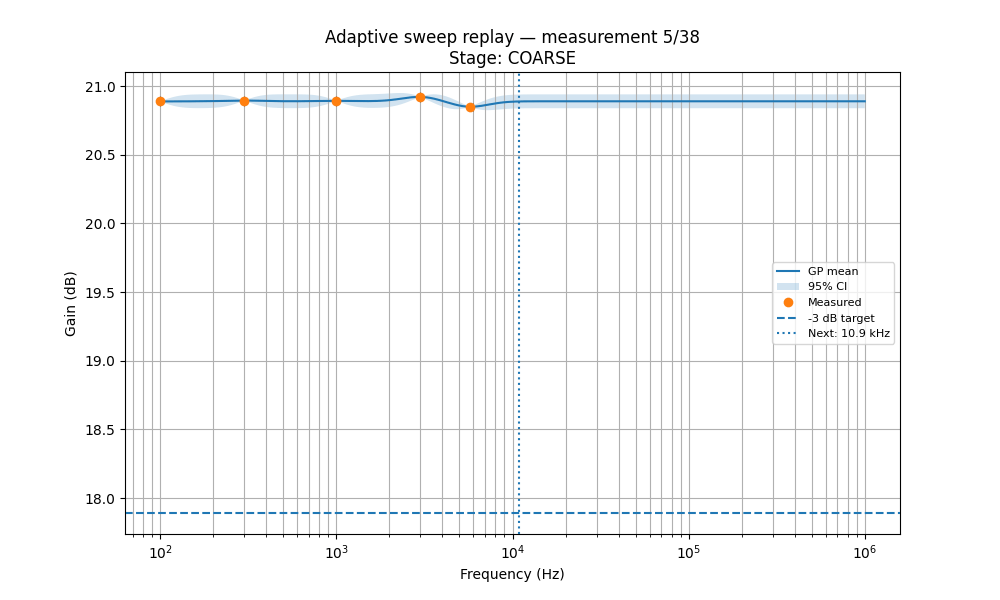
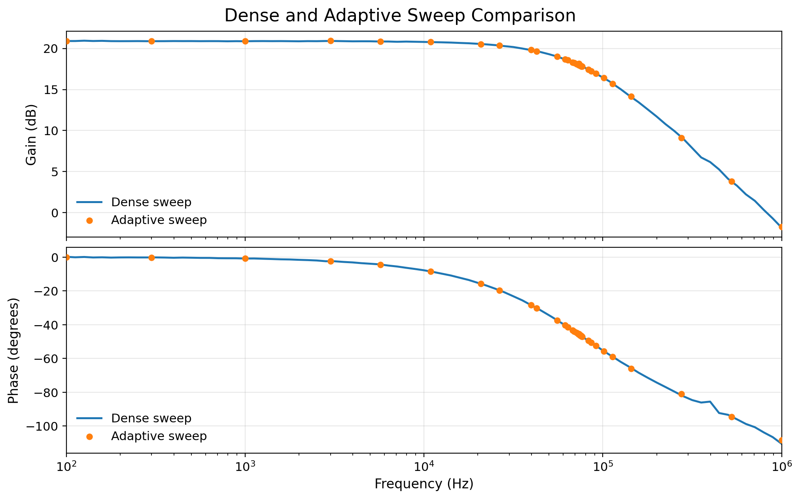
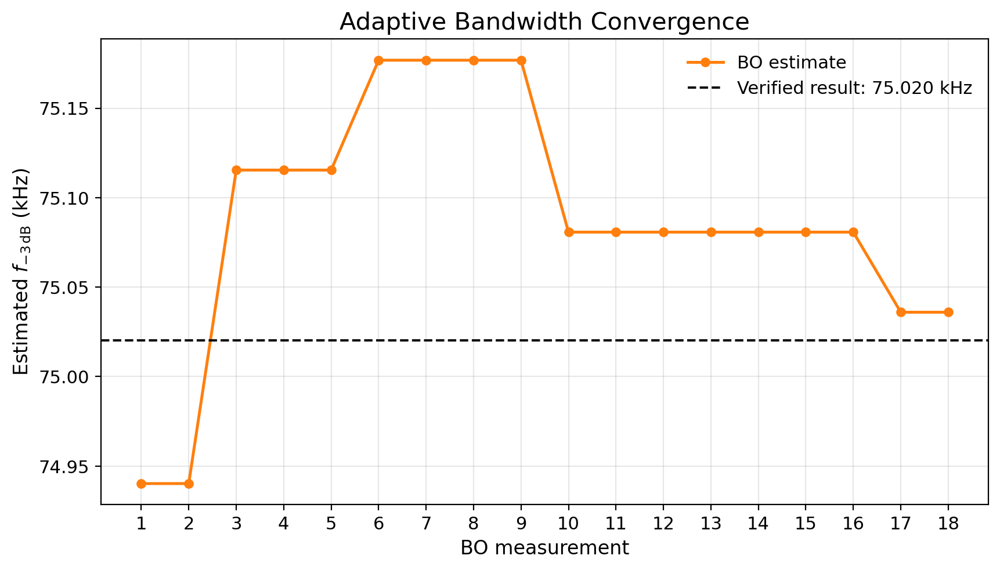

# Adaptive AC Analysis

## Overview

An adaptive AC-analysis pipeline has been developed to estimate amplifier frequency response and -3 dB bandwidth with fewer physical measurements. The workflow uses Bayesian optimization with Ax to select frequency points based on a Gaussian-process model of the measured response and its uncertainty.

Instead of measuring a fixed dense grid, the algorithm concentrates measurements near the expected cutoff region while retaining enough points to characterize the overall gain and phase response.

## Adaptive Sweep

The pipeline:

1. measures the passband gain and defines the -3 dB target,
2. performs a short coarse sweep to locate the cutoff region,
3. uses Ax to select additional frequencies that improve the bandwidth estimate, and
4. verifies the final crossing with a small local sweep.

This creates a closed loop: **select frequency -> measure response -> update model -> select the next frequency**.

## Demonstration Results

The adaptive method was compared with a conventional dense sweep using the same amplifier configuration. The values below use the matched 100 Hz to 1 MHz comparison range.

| Metric | Dense sweep | Adaptive sweep | Difference |
| --- | ---: | ---: | ---: |
| Physical measurements | 100 | 38 | 62.0% fewer |
| Acquisition time | 43.75 s | 17.11 s | 60.9% less (2.56x faster) |
| Passband gain | 20.889 dB | 20.892 dB | 0.003 dB |
| -3 dB bandwidth | 74.925 kHz | 75.020 kHz | 0.127% |
| Phase at bandwidth | -46.378 deg | -46.348 deg | 0.030 deg |

The adaptive sweep reduced both the number of measurements and acquisition time by approximately 61-62%, while closely reproducing the dense-sweep gain, phase, and bandwidth results.

## Bandwidth Convergence

The model's bandwidth estimate stabilizes near the independently verified -3 dB result as the adaptive measurements are added.

This demonstration establishes the adaptive measurement pipeline for efficient AC characterization. The same workflow can be reused for other amplifiers and post-tapeout devices by changing the test configuration and search range.
