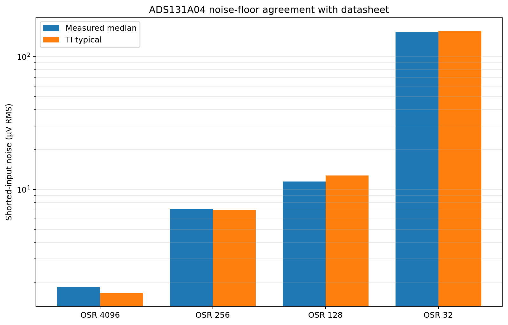
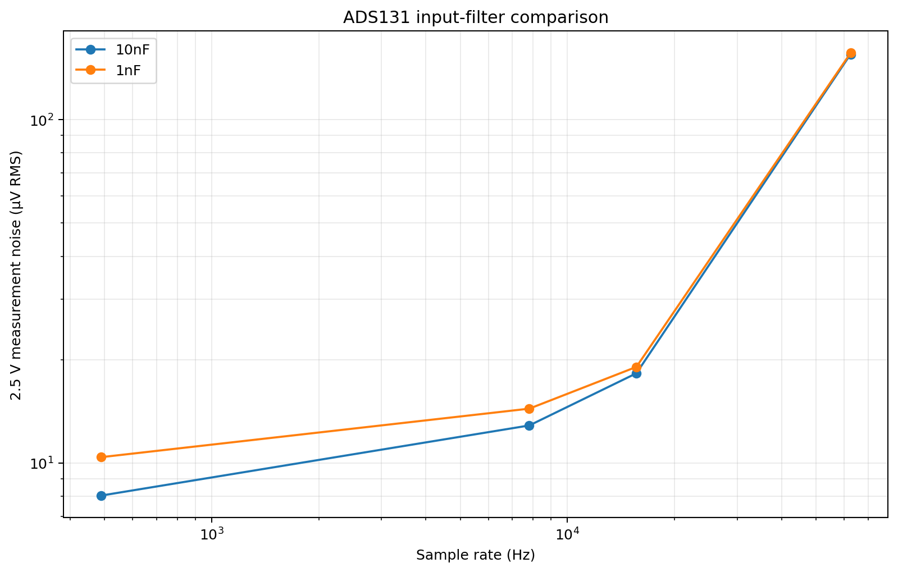
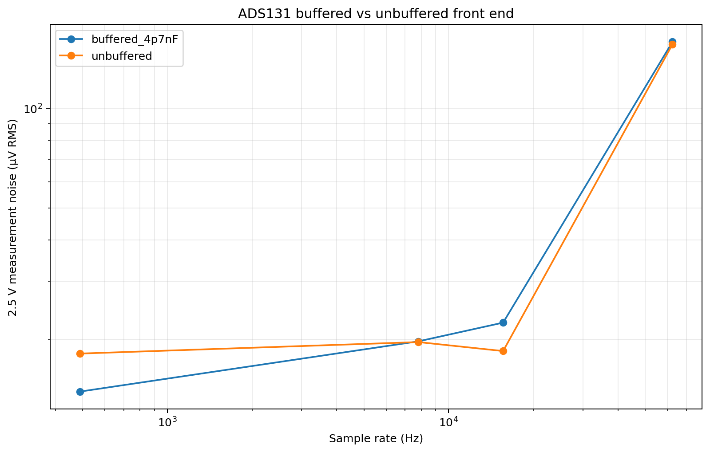
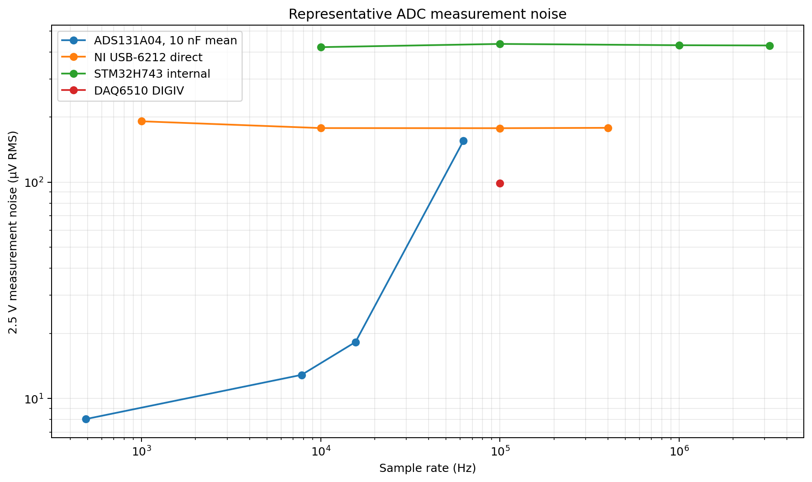

# ADC Characterization

## Overview

The ADC subsystem was characterized to evaluate:

1. ADS131A04 noise versus oversampling ratio,
2. the effect of RC-filter capacitance on measurement noise,
3. the effect of the OPA4388 input buffer, and
4. two-point DC accuracy.

The ADS131A04 results are also compared with the NI USB-6212, STM32H743 internal ADC,
and Keithley DAQ6510 measurements to show the precision/speed tradeoff across the test station.

## Measurement Setup

A precision ADR4525 reference was used as the approximately 2.5 V DC source. The reference
voltage used for DC-error calculations was measured with the DAQ6510 as:

**Reference voltage used for DC-error calculations: 2.499940308 V.**

Each ADS configuration was measured with:

- **ZERO:** differential input shorted to measure offset and intrinsic noise.
- **ADR4525:** approximately 2.5 V applied to measure signal noise and two-point DC error.

All tested RC filters use a **100 Ω series resistor**. The configurations were:

| Configuration | Buffer |
|---------------|--------|
| 100 Ω + 10 nF | OPA4388 enabled |
| 100 Ω + 1 nF | OPA4388 enabled |
| 100 Ω + 4.7 nF | OPA4388 enabled |
| 100 Ω + 4.7 nF | OPA4388 bypassed |

This arrangement allows the **10 nF versus 1 nF** results to compare filter capacitance,
while the two **4.7 nF** configurations isolate the effect of the input buffer.

The primary ADS operating points were OSR4096, OSR256, OSR128, and OSR32.

## Noise versus OSR

Increasing OSR strongly reduces the ADS131A04 input-referred noise floor.

| OSR | Project rate | Measured median ZERO noise | Datasheet typical | Error vs datasheet |
|----:|-------------:|---------------------------:|------------------:|-------------------:|
| 4096 | 488.281 S/s | 1.85 µV RMS | 1.66 µV RMS | +11.4% |
| 256 | 7.8125 kS/s | 7.15 µV RMS | 7.02 µV RMS | +1.9% |
| 128 | 15.625 kS/s | 11.47 µV RMS | 12.72 µV RMS | -9.8% |
| 32 | 62.5 kS/s | 154.83 µV RMS | 156.92 µV RMS | -1.3% |

The measurements closely follow the expected OSR-dependent noise behavior. The comparison
is made by OSR; the project modulator-clock condition is not identical to the datasheet
test condition, so this is an OSR-based performance comparison rather than an exact
replication of the datasheet test setup.

## Datasheet Comparison

Across the tested shorted-input measurements, the converter noise floor is close to the
expected typical performance. OSR256, OSR128, and OSR32 are within a few to roughly ten
percent of the corresponding typical values.

This agreement indicates that the ADC subsystem is operating close to the expected
converter noise floor.

## Input Filter Comparison

The filter comparison keeps the resistor fixed at **100 Ω** and the OPA4388 buffer
**enabled**, while changing only the capacitor from **1 nF** to **10 nF**.

| Rate | 100 Ω + 10 nF signal noise | 100 Ω + 1 nF signal noise | 10 nF, 1–200 Hz | 1 nF, 1–200 Hz |
|-----:|----------------------------:|---------------------------:|----------------:|---------------:|
| 488.281 S/s | 8.04 µV RMS | 10.40 µV RMS | 4.49 µV RMS | 7.00 µV RMS |
| 7.8125 kS/s | 12.87 µV RMS | 14.41 µV RMS | 4.91 µV RMS | 6.25 µV RMS |
| 15.625 kS/s | 18.26 µV RMS | 19.06 µV RMS | 6.06 µV RMS | 6.52 µV RMS |
| 62.5 kS/s | 155.13 µV RMS | 156.33 µV RMS | 5.25 µV RMS | 7.87 µV RMS |

The **100 Ω + 10 nF filter is preferred** for precision measurements. It gives lower
reference-signal noise and lower 1–200 Hz integrated noise than the otherwise comparable
100 Ω + 1 nF configuration across the tested operating points.

At the recommended OSR256 setting, the 10 nF filter measured approximately
**12.87 µV RMS** signal noise and **4.91 µV RMS** integrated noise from 1–200 Hz.

## Buffer Comparison

The buffer comparison uses the same **100 Ω + 4.7 nF RC filter** in both cases.

| Rate | Buffered signal noise | Buffer-bypassed signal noise | Buffered DC error | Buffer-bypassed DC error |
|-----:|----------------------:|-----------------------------:|------------------:|-------------------------:|
| 488.281 S/s | 13.89 µV RMS | 18.11 µV RMS | -2164.5 ppm | -837.8 ppm |
| 7.8125 kS/s | 19.73 µV RMS | 19.62 µV RMS | -2162.4 ppm | -858.1 ppm |
| 15.625 kS/s | 22.47 µV RMS | 18.43 µV RMS | -2165.7 ppm | -876.0 ppm |
| 62.5 kS/s | 158.92 µV RMS | 156.21 µV RMS | -2165.9 ppm | -706.1 ppm |

The buffer does not produce a large broadband-noise penalty, but the buffered 4.7 nF
configuration shows an approximately **-0.216% residual DC error**, compared with roughly
**-0.086%** at OSR256 for the buffer-bypassed 4.7 nF configuration.

The buffer therefore remains useful when input isolation or source impedance requires it,
while the measured DC offset/gain behavior should be considered when absolute accuracy is
important.

## DC Accuracy

ADS131 DC accuracy is reported after applying the matched ZERO measurement as an offset
correction. At OSR256, the configuration-level results are approximately:

| Configuration | Two-point DC error |
|---------------|-------------------:|
| 100 Ω + 10 nF, buffered | ~0.076% |
| 100 Ω + 1 nF, buffered | ~0.080% |
| 100 Ω + 4.7 nF, buffered | ~0.216% |
| 100 Ω + 4.7 nF, buffer bypassed | ~0.086% |

The 10 nF and 1 nF filter configurations show similar two-point DC accuracy, while the
buffered 4.7 nF configuration shows the largest systematic error.

## Recommended ADS131A04 Configuration

For general precision measurements, the best tested filter configuration is:

**OPA4388 buffered + 100 Ω + 10 nF, operated at OSR256 / 7.8125 kS/s.**

| Goal | Configuration | Rate | ZERO noise | 2.5 V signal noise | 1–200 Hz noise |
|------|---------------|-----:|-----------:|--------------------:|---------------:|
| Minimum noise | 100 Ω + 10 nF, OSR4096 | 488.281 S/s | ~2.1 µV RMS | ~8.0 µV RMS | ~4.5 µV RMS |
| **Recommended precision** | **100 Ω + 10 nF, OSR256** | **7.8125 kS/s** | **~7.1 µV RMS** | **~12.9 µV RMS** | **~4.9 µV RMS** |
| Higher bandwidth | 100 Ω + 10 nF, OSR128 | 15.625 kS/s | ~11.4 µV RMS | ~18.3 µV RMS | ~6.1 µV RMS |
| Maximum ADS rate | 100 Ω + 10 nF, OSR32 | 62.5 kS/s | ~154.7 µV RMS | ~155.1 µV RMS | ~5.3 µV RMS |

OSR256 provides the best general balance between noise and sample rate. OSR4096 is
preferred when minimum noise is more important than bandwidth.

## System Context

The test station provides acquisition systems with different precision/speed tradeoffs.

| Acquisition system | Representative rate | Representative measured signal noise | Primary role |
|--------------------|--------------------:|-------------------------------------:|--------------|
| ADS131A04, 100 Ω + 10 nF | 7.8125 kS/s | 12.87 µV RMS | Precision / low-noise acquisition |
| DAQ6510 DIGIV | 100 kS/s | 98.68 µV RMS | Laboratory reference / digitizer |
| NI USB-6212 direct | 400 kS/s | 178.29 µV RMS | Higher-rate external acquisition |
| STM32H743 internal ADC | 3.2 MS/s | 428.29 µV RMS | Fast onboard transient capture |

## Summary

The characterization supports four main conclusions:

- ADS131A04 shorted-input noise closely follows the expected datasheet trend across the
  tested OSRs.
- With the resistor fixed at **100 Ω** and the buffer enabled, **10 nF** performs better
  than **1 nF** for precision measurements.
- The **4.7 nF buffered versus buffer-bypassed** comparison shows that buffering has only
  a modest effect on broadband noise but a larger effect on two-point DC accuracy.
- **OSR256 / 7.8125 kS/s** with the tested **100 Ω + 10 nF buffered configuration** is the
  recommended general precision operating point.

For hardware architecture, firmware, and Python usage, return to the
[ADC subsystem overview](./).