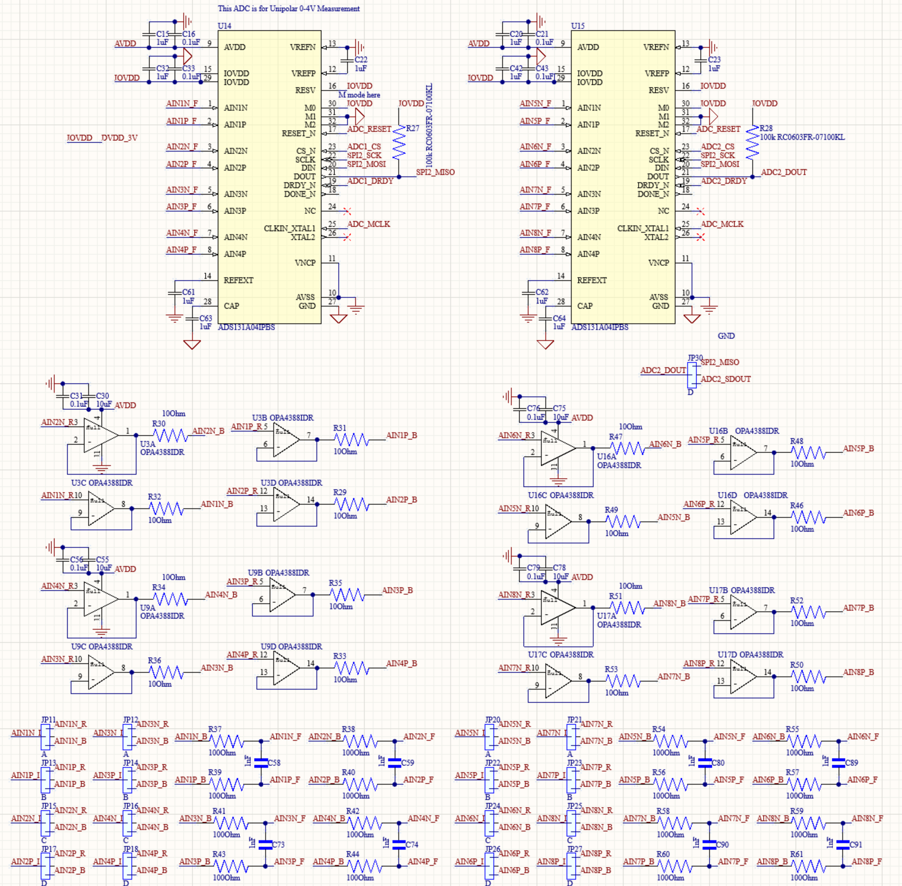
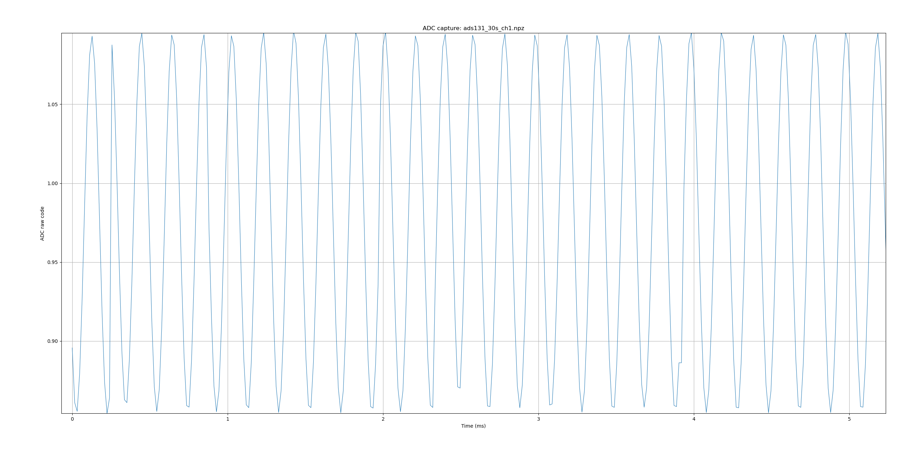
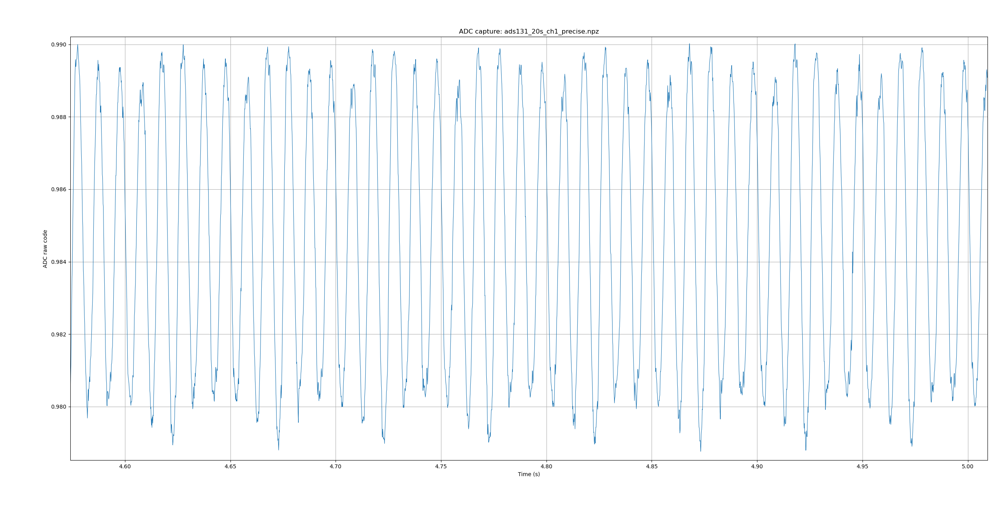

# ADC -- Precision Voltage Measurement

## Overview

Two ADS131A04 ADCs provide eight differential input channels with 24-bit
conversion. The STM32 communicates with both ADCs through SPI2 and supports
DMA-based acquisition. Each motherboard input channel includes an optional
external OPA4388 unity-gain buffer followed by an RC anti-aliasing filter.

Blocking acquisition can read all eight channels sequentially. Because both
ADCs share SPI2 and the current DMA implementation selects one ADC at a time,
continuous DMA streaming captures four simultaneous channels from one chip.

With the current clock configuration, the highest tested streaming rate is
62.5 kSPS per channel at OSR32. Offset calibration is available for all eight
channels to remove residual system offsets.

## Schematic



## Key Specifications

| Parameter | Value |
|-----------|-------|
| Resolution | 24-bit |
| Channels | 4 differential per chip, 8 total (2 chips) |
| Input range | +/-4.0V differential (0-4V single-ended) |
| Reference | Internal 4.0V (AVDD=5V) |
| LSB size | 476 nV |
| Default data rate | 8.0 kSPS (OSR_256) |
| Max reliable data rate | 62.5 kSPS (OSR_32, DMA streaming) |
| MCLK | 8 MHz (STM32 MCO1, PA8) |
| Interface | SPI2 + DMA1 Stream3 |

### Data Rate Options

The following rates use the current 2 MHz modulator clock:

| OSR | Data rate | Typical use |
|-----|-----------|-------------|
| 4096 | 0.488 kSPS | Lowest-noise DC acquisition |
| 1024 | 1.953 kSPS | Low-frequency measurements |
| 400 | 5.000 kSPS | TIA B_20K range |
| 256 | 7.8125 kSPS | Default voltage acquisition |
| 128 | 15.625 kSPS | Higher-bandwidth acquisition |
| 32 | 62.500 kSPS | Highest tested DMA rate |

## Hardware Configuration

### Pin Assignment

| Signal | STM32 Pin | Notes |
|--------|-----------|-------|
| SPI2 SCLK | PB13 | Shared by both chips |
| SPI2 MISO | PB14 | Shared -- one chip active at a time |
| SPI2 MOSI | PB15 | Shared by both chips |
| CS1 | PE1 | Chip 1, active low |
| CS2 | PE0 | Chip 2, active low |
| DRDY1 | PE2 | EXTI2, falling edge triggers DMA |
| DRDY2 | PE3 | EXTI3, falling edge triggers DMA |
| RESET | PE4 | Shared, active low |
| MCLK | PA8 | MCO1 output, 8 MHz |

### Signal Conditioning

Each differential input pair includes an optional external OPA4388
unity-gain buffer followed by an RC anti-aliasing filter. The OPA4388 is
located on the motherboard and is not integrated into the ADS131A04.

For the quad OPA4388, the input offset voltage is ±2.25 µV typical and
±8 µV maximum at a 5.5 V supply. Its zero-drift architecture provides
stable low-frequency performance and very low 1/f noise. The buffer can be
bypassed using a solder jumper: enable it for high-impedance sources and
bypass it when the source impedance is sufficiently low. See the schematic
for the RC-filter cutoff frequency.

### DMA Streaming

When a conversion completes, the ADS131A04 asserts DRDY low, triggering an EXTI interrupt on the STM32. DMA immediately pulls all 15 bytes of the SPI frame (status + 4 channel samples) into non-cacheable SRAM without CPU involvement. Completed frames are written into a 256-slot ring buffer, which a background task drains into binary USB CDC packets. On the PC, `read_dma()` unpacks 24-bit samples into numpy arrays and updates a live plot in real time.
Because the two ADCs share SPI2 and the current DMA implementation selects
one chip at a time, DMA streaming captures four simultaneous channels from
one ADC. `ADS131A04_ReadBoth()` and the Python `read_all()` method read all
eight channels sequentially.

## Firmware

Driver files: `ads131a04.c`, `ads131a04.h`

```c
void    ADS131A04_HWReset(void);                                    // assert/release shared RESET pin
uint8_t ADS131A04_Init(uint8_t chip, ADS131_OSR_t osr);            // configure chip, enable all 4 channels, returns 1 on success
void    ADS131A04_SetOSR(uint8_t chip, ADS131_OSR_t osr);          // change data rate on running chip
uint8_t ADS131A04_ReadFrame(uint8_t chip, ADS131_Frame_t *frame);  // blocking single read, waits for DRDY
uint8_t ADS131A04_ReadBoth(ADS131_Frame_t *f1, ADS131_Frame_t *f2); // read both chips in sequence
```

OSR constants range from `ADS131_OSR_4096` (0.5 kSPS) to `ADS131_OSR_256` (8 kSPS, default) to `ADS131_OSR_32` (62.5 kSPS max).
DMA functions `ADS131A04_DMA_StartChip()` and `ADS131A04_DMA_RxComplete()` are called automatically by the EXTI and DMA ISRs.

## Python API (`ads131a04.py`)

```python
from config import STM_COM_PORT
from hardware.ads131a04 import ADS131

adc = ADS131(port=STM_COM_PORT)

# -- Setup --
adc.load_cal()                 # load saved offset calibration (run once at session start)
adc.set_osr(chip=1, osr=256)   # set data rate: 8.0 kSPS default
adc.set_osr(chip=1, osr=32)    # or 62.5 kSPS for max speed

# -- Calibration (short AINxP to AINxN before running) --
adc.calibrate()                # measure and save offsets for both chips -> cal_ads131.json
adc.clear_cal()                # remove all offset corrections

# -- Single reads --
v = adc.read_single(chip=1, ch=1)        # one channel -> float volts
frame = adc.read_frame(chip=1)           # all 4 channels -> {1: V, 2: V, 3: V, 4: V}
data = adc.read_all()                    # all 8 channels (both chips) -> {'C1CH1': V, ...}

# -- Buffered acquisition (ASCII, moderate speed) --
v, t = adc.read_buffered(chip=1, num_frames=100)
# v: numpy array (4, N) -- one row per channel, t: timestamps in seconds

# -- DMA streaming (binary, max throughput, live plot) --
v, t = adc.read_dma(chip=1, num_frames=50000, duration=30.0,
                    display_ch=1, csv_filename="capture.csv")

# -- Continuous live plot (runs until window closed or duration reached) --
v, t = adc.read_continuous(chip=1, ch=1, duration=None,
                            window_sec=5.0, csv_filename="live.csv")

# -- Diagnostics --
adc.selftest()                 # read status registers + one frame per chip
adc.status(chip=1)             # returns {'ID': '0x04', 'STAT': '0x00', ...}
```

## Measured Performance

DMA streaming runs stably at **62.5 kSPS** (OSR_32) with zero overrun errors. Default sessions use **8.0 kSPS** (OSR_256) for a good balance of noise and throughput.

**5 kHz sine at 62.5 kSPS** -- clean reconstruction with ~12 samples per cycle over a 5ms window. A single dropped DMA frame is visible over a 30-second recording, expected at near-maximum rate.



**10 mVpp signal at ~8 kSPS** -- 10 mVpp signal (10,000 uV peak-to-peak) resolved clearly above the noise floor, with smooth consistent waveform shape across a 0.4s window.

