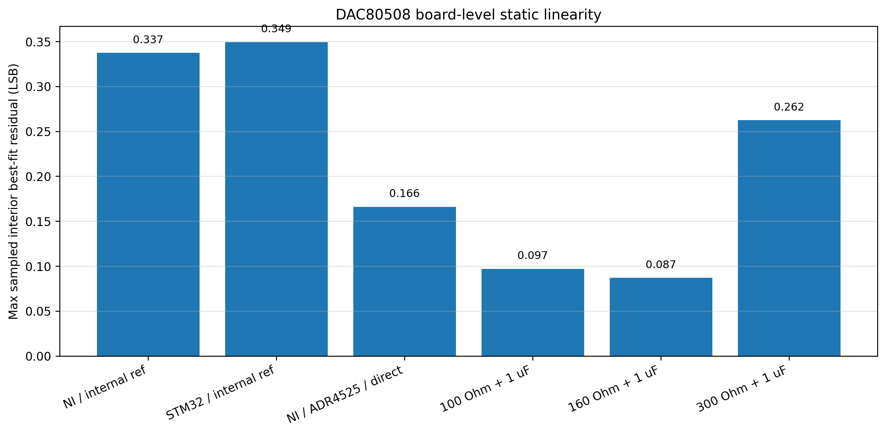
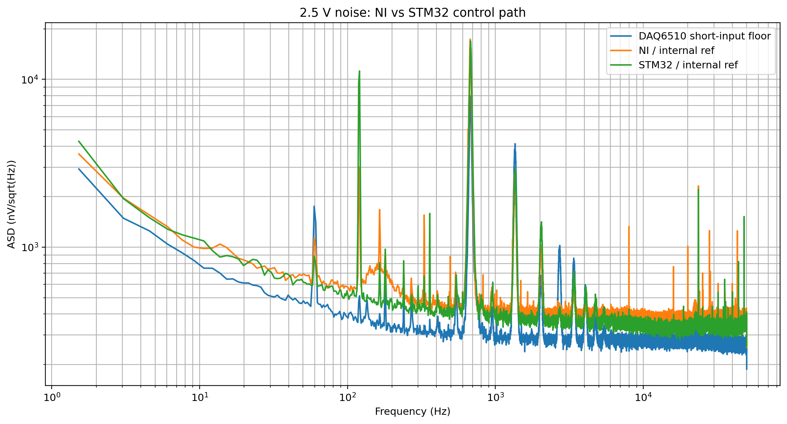
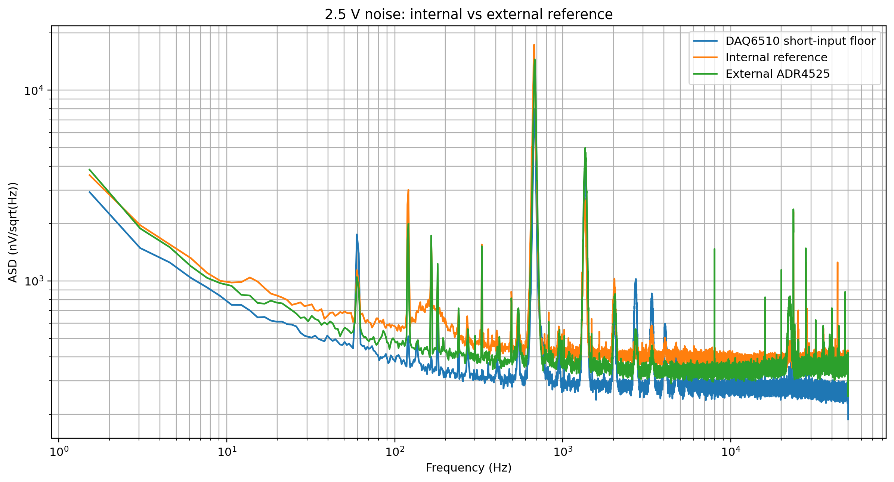
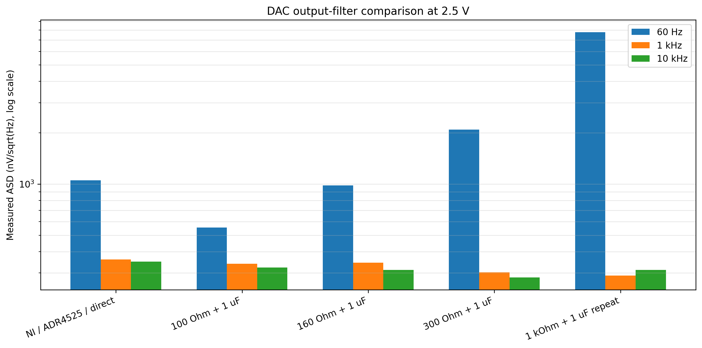
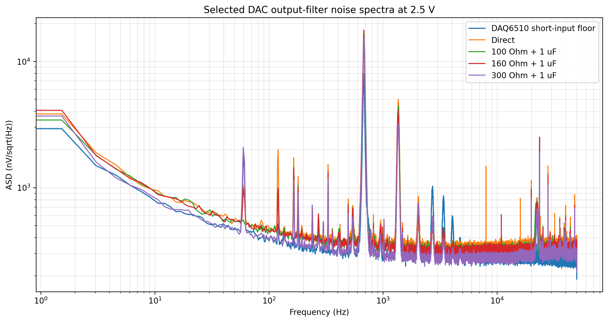

# DAC Characterization

## Overview

The V3 DAC subsystem was characterized to verify board-level static accuracy,
controller independence, reference selection, output-filter behavior, and
system-level noise performance. The measurements below use the DAC80508
subsystem together with the Keithley DAQ6510 as the precision measurement
instrument.

## Test Setup and Method

| Item | Configuration |
|------|---------------|
| DAC | DAC80508, 16 bit, 0-5 V |
| DAC count | 5 devices, 40 total channels |
| Control paths | NI USB-6212 and STM32H743 |
| Reference options | Internal 2.5 V reference or ADR4525 external reference |
| Static test | Sparse DC sweep across the programmed range |
| Noise acquisition | DAQ6510 digitize mode, 100 kS/s, 60 s |
| Main noise bias point | 2.5 V |
| Additional bias points | Approximately 0.5 V and 4.5 V on selected runs |
| Instrument baseline | DAQ6510 short-input measurement |
| DAQ6510 short-input RMS floor | 78.4 uVrms |

Static linearity is reported as a **sparse interior best-fit residual**. The
near-5 V endpoint is not used as the primary linearity metric because output
headroom near the positive supply can dominate the full-range endpoint error.

## Measurement Interpretation

:::caution Noise Measurement Floor

Noise measurements include the Keithley DAQ6510 measurement chain. The
DAQ6510 short-input baseline is approximately **78.4 uVrms**, while many of
the DAC measurements are approximately 100-120 uVrms. The broadband noise
results are therefore partly instrument-floor limited.

The reported RMS and spectral-density values should be interpreted as
**measured system-level values and practical upper bounds**, rather than as a
direct measurement of the intrinsic DAC80508 noise floor.

:::

## Static Accuracy

All selected configurations were monotonic over the sampled static sweep. The
external-reference and filtered configurations produced sub-LSB interior
best-fit residuals.

| Configuration | Max sampled interior residual | Interior gain error | Max interior absolute error |
|---------------|-------------------------------|---------------------|-----------------------------|
| NI + internal reference | 0.337 LSB | -558.4 ppm | 2.248 mV |
| STM32 + internal reference | 0.349 LSB | -581.8 ppm | 2.278 mV |
| NI + ADR4525, direct | 0.166 LSB | -440.5 ppm | 1.686 mV |
| ADR4525 + 100 Ohm + 1 uF | 0.097 LSB | -479.9 ppm | 1.804 mV |
| ADR4525 + 160 Ohm + 1 uF | 0.087 LSB | -697.3 ppm | 2.308 mV |
| ADR4525 + 300 Ohm + 1 uF | 0.262 LSB | -824.8 ppm | 3.207 mV |

The **160 Ohm + 1 uF** path produced the smallest measured sparse residual.
However, static residual alone was not used to select the preferred system
configuration.

## NI vs STM32 Control Path

The NI and STM32 control paths were compared using the internal reference. The
two paths produced closely comparable static and noise results, indicating that
the STM32 control path does not materially degrade DAC output performance.

| Metric | NI control | STM32 control |
|--------|------------|---------------|
| Max sampled interior residual | 0.337 LSB | 0.349 LSB |
| Interior gain error | -558.4 ppm | -581.8 ppm |
| DC error at 2.5 V | -0.963 mV | -1.104 mV |
| Measured system RMS at 2.5 V | 116.4 uVrms | 111.5 uVrms |
| Measured system ASD at 60 Hz | 1140 nV/sqrt(Hz) | 886 nV/sqrt(Hz) |
| Measured system ASD at 1 kHz | 418 nV/sqrt(Hz) | 417 nV/sqrt(Hz) |
| Measured system ASD at 10 kHz | 371 nV/sqrt(Hz) | 347 nV/sqrt(Hz) |

The close agreement supports use of the STM32H743 as the normal deployed
controller while retaining the NI interface for laboratory control and debug.

## Internal vs External Reference

The ADR4525 external reference improved the measured static result relative to
the DAC80508 internal reference and also modestly reduced several measured
noise-density values.

| Metric | Internal reference | ADR4525 external reference |
|--------|--------------------|----------------------------|
| Max sampled interior residual | 0.337 LSB | 0.166 LSB |
| Interior gain error | -558.4 ppm | -440.5 ppm |
| DC error at 2.5 V | -0.963 mV | -0.660 mV |
| Measured system RMS at 2.5 V | 116.4 uVrms | 110.1 uVrms |
| Measured system ASD at 60 Hz | 1140 nV/sqrt(Hz) | 1049 nV/sqrt(Hz) |
| Measured system ASD at 1 kHz | 418 nV/sqrt(Hz) | 361 nV/sqrt(Hz) |
| Measured system ASD at 10 kHz | 371 nV/sqrt(Hz) | 350 nV/sqrt(Hz) |

The ADR4525 is therefore used as the preferred precision reference for the
characterized output configuration.

## Output Filter Comparison

Several 1 uF RC output filters were compared at 2.5 V. The filter comparison
shows a tradeoff between static accuracy, mains-frequency susceptibility, and
higher-frequency attenuation.

All RMS and ASD values below are measured system-level values and include the DAQ6510 measurement contribution.

| Output path | Sampled residual | RMS noise | 60 Hz ASD | 1 kHz ASD | 10 kHz ASD |
|-------------|------------------|-----------|-----------|-----------|------------|
| ADR4525 direct | 0.166 LSB | 110.1 uVrms | 1049 nV/sqrt(Hz) | 361 nV/sqrt(Hz) | 350 nV/sqrt(Hz) |
| 100 Ohm + 1 uF | 0.097 LSB | 110.5 uVrms | 556 nV/sqrt(Hz) | 340 nV/sqrt(Hz) | 323 nV/sqrt(Hz) |
| 160 Ohm + 1 uF | 0.087 LSB | 110.6 uVrms | 980 nV/sqrt(Hz) | 345 nV/sqrt(Hz) | 312 nV/sqrt(Hz) |
| 300 Ohm + 1 uF | 0.262 LSB | 98.8 uVrms | 2085 nV/sqrt(Hz) | 303 nV/sqrt(Hz) | 282 nV/sqrt(Hz) |
| 1 kOhm + 1 uF | 0.209 LSB | 110.1 uVrms | 7778 nV/sqrt(Hz) | 289 nV/sqrt(Hz) | 312 nV/sqrt(Hz) |

The 300 Ohm path gives lower measured high-frequency ASD, but its static
accuracy is worse and its 60 Hz component is larger. The 1 kOhm path gives
stronger low-pass action at higher frequency, but it also shows a large and
reproducible 60 Hz component.

The 1 kOhm behavior was confirmed by the original channel, a repeat
measurement, and a second 1 kOhm channel, with approximately
7.78-8.08 uV/sqrt(Hz) measured at 60 Hz. It is therefore retained as a real
path/setup susceptibility rather than treated as a single bad capture.

## Recommended Configuration

The preferred precision configuration is:

**ADR4525 external reference + 100 Ohm + 1 uF output filter**

This configuration was selected as the best overall engineering tradeoff:

- **0.097 LSB** maximum sampled interior best-fit residual.
- **-479.9 ppm** interior gain error.
- **1.804 mV** maximum measured interior absolute error.
- **556 nV/sqrt(Hz)** at 60 Hz.
- **340 nV/sqrt(Hz)** at 1 kHz.
- **323 nV/sqrt(Hz)** at 10 kHz.
- Sampled monotonic behavior across the characterized static sweep.

The 160 Ohm + 1 uF path gives a slightly smaller static residual
(0.087 LSB), but the 100 Ohm + 1 uF path shows lower 60 Hz pickup and better
overall DC error behavior. The 100 Ohm path is therefore used as the preferred
default rather than selecting the filter from a single metric.

Return to the [DAC subsystem page](./).
