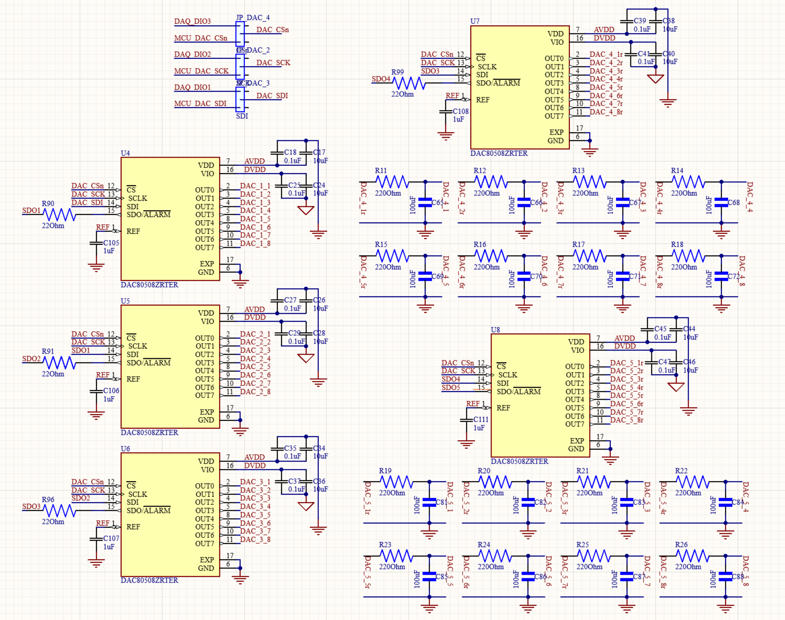

# DAC -- Bias Voltage Generation

## Overview

Five 16-bit, 8-channel DACs provide 40 independently programmable DC bias
channels. The devices are connected in a five-chip daisy chain using an
SPI-compatible serial protocol generated through GPIO bit-banging. The chain
can be controlled by either the NI USB-6212 or the STM32, selected by a shunt
jumper. DAC4 and DAC5 include per-channel RC output filters for noise-sensitive
measurements.

## Version History

Three DAC families have been used across board generations, all with the
same five-chip daisy-chain topology. Each version uses serial data, clock,
and chip-select or synchronization signals, with serial-data-output
connections between adjacent devices. The LTC2600 and AD5676R require an
additional hardware clear or reset signal, while the DAC80508 supports
software reset.

| Version | Chip | Output range | INL | Interface |
|---------|------|--------------|-----|-----------|
| V1 | LTC2600 | 0–4 V with external reference | ±2 LSB typical | Serial interface with hardware clear |
| V2 | AD5676R | 0–5 V | ±3 LSB maximum | SPI-compatible interface with hardware reset |
| V3 (current) | DAC80508 | 0–5 V | ±1 LSB maximum | SPI-compatible interface with software reset |

The active version is selected in `config.py`:

```python
DAC_VERSION = "DAC80508"   # "LTC2600" | "AD5676R" | "DAC80508"
```

## Schematic



## Key Specifications

| Parameter | LTC2600 (V1) | AD5676R (V2) | DAC80508 (V3) |
|-----------|-------------|-------------|--------------|
| Resolution | 16-bit | 16-bit | 16-bit |
| Channels per chip | 8 | 8 | 8 |
| Output range | 0 to VREF | 0-2.5V or 0-5V | 0-5V (gain=2) |
| DNL | +/-1 LSB max | +/-1 LSB max | +/-1 LSB max |
| INL | +/-2 LSB typ | +/-3 LSB max | +/-1 LSB max |
| Gain error | +/-0.3% FSR typ | +/-0.06% FSR max | +/-0.1% FSR max |
| Internal reference | None | 2.5V, 2 ppm/°C typ | 2.5V, 2 ppm/°C typ |
| Noise density | 120 nV/sqrtHz @ 1kHz | 80 nV/sqrtHz @ 10kHz (ext ref) | 78 nV/sqrtHz @ 1kHz |
| Noise (0.1-10Hz) | -- | 6 uVpp | 14 uVpp |
| Settling time | 9.7 us (1/4 to 3/4 scale) | 5 us typ, 8 us max | 5 us (1/4 to 3/4 scale) |
| Slew rate | 0.8 V/us | 0.8 V/us | 1.8 V/us |
| Short-circuit current | +/-15 mA min | 40 mA | 30 mA |
| Supply range | 2.5-5.5V | 2.7-5.5V | 2.7-5.5V |
| Serial-clock limit | 50 MHz | 50 MHz | Up to 25 MHz in daisy-chain mode |
| Temperature range | -40 to 85 °C | -40 to 125 °C | -40 to 125 °C |

## Hardware Configuration

### Reference Selection

A 0 Ohm resistor jumper controls whether the DAC80508 uses its internal 2.5V reference or the external ADR4525CRZ. When the resistor is populated, the REF pin connects to the ADR4525 output. When removed, the internal reference is active. Both give the same 0-5V output range.

:::warning External Reference Selection

When the external ADR4525 reference is connected, the DAC80508 internal
reference must be disabled. Enabling both references simultaneously causes
the two voltage sources to contend and can corrupt the DAC output.

For the NI control path, initialize the DAC using
`dac_initialize(use_external_ref=True)`. The STM32 firmware must likewise
disable the internal reference when the external-reference jumper is
populated.

:::

### Control Path Selection

| Jumper | DAC driven by |
|--------|--------------|
| NI position | NI USB-6212 (port0/line1-3, software-timed) |
| STM position | STM32H743 (PE11 SDI, PE12 SCLK, PE14 CS) |

## Firmware

Driver files: `dac80508.c`, `dac80508.h`

```c
// Initialize all 5 chips -- call once at startup
void DAC80508_Init(void);

// Set one channel by raw 16-bit code (0x0000 = 0V, 0xFFFF = 5V)
void DAC80508_SetChannel(uint8_t chip, uint8_t channel, uint16_t code);

// Set one channel by voltage (0.0-5.0V, clamped)
void DAC80508_SetVoltage(uint8_t chip, uint8_t channel, float voltage);

// Zero all 40 outputs
void DAC80508_ClearAll(void);
```

## Python API

### NI Path (`dac_dac80508.py`)

```python
from hardware import dac_initialize, set_voltage, dac_clear_all, get_voltage, dac_print_state

# Initialize with internal reference (default)
dac_initialize()

# Initialize with external ADR4525 reference instead
dac_initialize(use_external_ref=True)

# Set chip 2, channel 3 to 1.8V
set_voltage(2, 3, 1.8)

# Read back last commanded voltage (Python shadow state, not hardware readback)
v = get_voltage(2, 3)

# Print 5x8 voltage table
dac_print_state()

# Zero all outputs and close NI task
dac_clear_all()
```

### STM32 Path (`stm_dac80508.py`)

```python
from hardware.stm_dac80508 import initialize, set_voltage, set_all, clear_all, print_state

# Zero all outputs at startup
initialize()

# Set chip 1, channel 1 to 1.0V
set_voltage(1, 1, 1.0)

# Set all 40 outputs to the same voltage
set_all(2.5)

# Zero all outputs
clear_all()

# Print 5x8 shadow state table
print_state()
```
