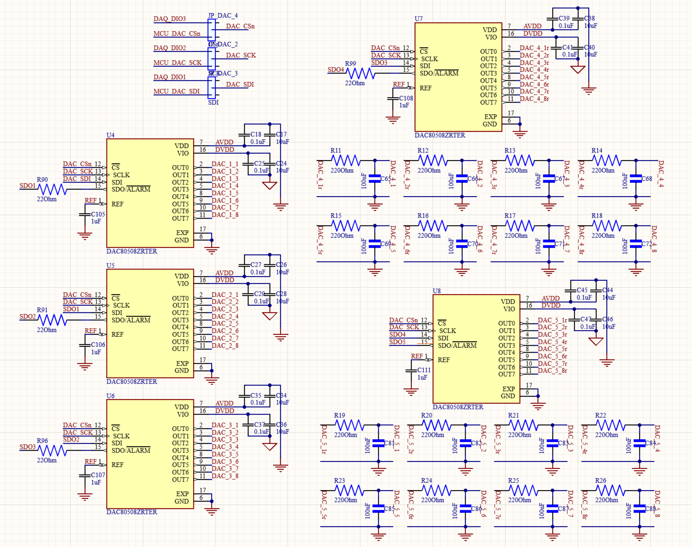
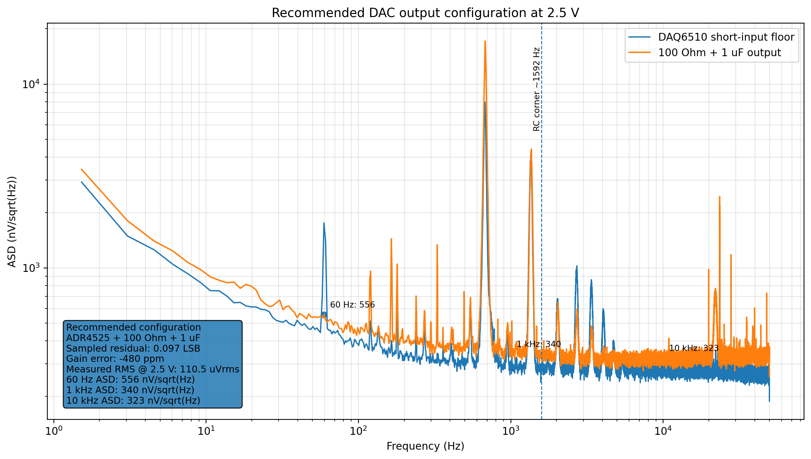

# DAC -- Bias Voltage Generation

## Overview

Five 16-bit, 8-channel DACs provide 40 independently programmable DC bias
channels over a 0-5 V range. The devices are connected in a five-chip daisy
chain using an SPI-compatible serial protocol. The chain can be controlled by
either the NI USB-6212 or the STM32H743, selected by a shunt jumper.

The current V3 design uses the DAC80508. It can operate from the DAC's internal
2.5 V reference or from the on-board ADR4525 precision reference. DAC4 and DAC5
also include per-channel RC output filtering for noise-sensitive bias outputs.

## Schematic



## Hardware Configuration

### Reference Selection

A 0 Ohm resistor jumper controls whether the DAC80508 uses its internal 2.5 V
reference or the external ADR4525CRZ. When the resistor is populated, the REF
pin connects to the ADR4525 output. When removed, the internal reference is
active. Both configurations provide the same 0-5 V output range.

:::warning External Reference Selection

When the external ADR4525 reference is connected, the DAC80508 internal
reference must be disabled. Enabling both references simultaneously causes
the two voltage sources to contend and can corrupt the DAC output.

For the NI control path, initialize the DAC using
`dac_initialize(use_external_ref=True)`. The STM32 firmware must likewise
disable the internal reference when the external-reference jumper is
populated.

:::

### Output Filtering

DAC4 and DAC5 include per-channel RC output-filter footprints. The V3
characterization compared direct output and several 1 uF filter combinations,
including 100 Ohm, 160 Ohm, 300 Ohm, and 1 kOhm series resistance.

The preferred precision configuration is:

**ADR4525 external reference + 100 Ohm + 1 uF output filter**

This configuration gives the best overall balance between measured static
accuracy, 60 Hz susceptibility, and higher-frequency noise behavior. The
160 Ohm + 1 uF path produced the smallest sampled static residual, but the
100 Ohm + 1 uF path is retained as the preferred system configuration.

### Control Path Selection

| Jumper | DAC driven by |
|--------|---------------|
| NI position | NI USB-6212 (port0/line1-3, software-timed) |
| STM position | STM32H743 (PE11 SDI, PE12 SCLK, PE14 CS) |

## Measured Performance

The table below summarizes the current V3 board-level characterization using
the preferred ADR4525 + 100 Ohm + 1 uF output path unless otherwise noted.

:::note Measurement Floor

Noise measurements include the DAQ6510 measurement chain. The DAQ6510
short-input RMS floor was approximately **78.4 uVrms**, so broadband noise
measurements near this level are partly instrument-floor limited.

The spectral-density values below are therefore reported as measured
**system-level values and practical upper bounds**, rather than as direct
measurements of the intrinsic DAC80508 noise floor. The static/DC metrics are
not limited by the DAQ6510 noise floor in the same way.

:::

### Static and DC Performance

| Parameter | Measured result |
|-----------|-----------------|
| Output range | 0-5 V |
| Resolution | 16 bit, 76.3 uV nominal LSB |
| Recommended configuration | ADR4525 + 100 Ohm + 1 uF |
| Recommended-path sampled interior residual | 0.097 LSB |
| Recommended-path interior gain error | -479.9 ppm |
| Recommended-path max interior absolute error | 1.804 mV |
| Sampled monotonicity | Yes |
| Best sampled interior residual | 0.087 LSB, 160 Ohm + 1 uF |

### Noise Performance

| Parameter | Measured result |
|-----------|-----------------|
| DAQ6510 short-input RMS floor | 78.4 uVrms |
| Measured system RMS at 2.5 V | 110.5 uVrms |
| Measured system ASD at 60 Hz | 556 nV/sqrt(Hz) |
| Measured system ASD at 1 kHz | 340 nV/sqrt(Hz) |
| Measured system ASD at 10 kHz | 323 nV/sqrt(Hz) |



For the complete static, controller, reference, and output-filter comparisons,
see [DAC Characterization](./characterization).

## DAC Versions and Specifications

Three DAC families have been used across board generations, all with the same
five-chip daisy-chain topology. Each version uses serial data, clock, and
chip-select or synchronization signals, with serial-data-output connections
between adjacent devices. The LTC2600 and AD5676R require an additional
hardware clear or reset signal, while the DAC80508 supports software reset.

The values below are device-level datasheet specifications and are kept
separate from the board-level measured results above.

| Parameter | LTC2600 (V1) | AD5676R (V2) | DAC80508 (V3) |
|-----------|--------------|--------------|---------------|
| Resolution | 16-bit | 16-bit | 16-bit |
| Channels per chip | 8 | 8 | 8 |
| Output range | 0 to VREF | 0-2.5 V or 0-5 V | 0-5 V (gain=2) |
| DNL | +/-1 LSB max | +/-1 LSB max | +/-1 LSB max |
| INL | +/-2 LSB typ | +/-3 LSB max | +/-1 LSB max |
| Gain error | +/-0.3% FSR typ | +/-0.06% FSR max | +/-0.1% FSR max |
| Internal reference | None | 2.5 V, 2 ppm/°C typ | 2.5 V, 2 ppm/°C typ |
| Noise density | 120 nV/sqrtHz @ 1 kHz | 80 nV/sqrtHz @ 10 kHz (ext ref) | 78 nV/sqrtHz @ 1 kHz |
| Noise (0.1-10 Hz) | -- | 6 uVpp | 14 uVpp |
| Settling time | 9.7 us (1/4 to 3/4 scale) | 5 us typ, 8 us max | 5 us (1/4 to 3/4 scale) |
| Slew rate | 0.8 V/us | 0.8 V/us | 1.8 V/us |
| Short-circuit current | +/-15 mA min | 40 mA | 30 mA |
| Supply range | 2.5-5.5 V | 2.7-5.5 V | 2.7-5.5 V |
| Serial-clock limit | 50 MHz | 50 MHz | Up to 25 MHz in daisy-chain mode |
| Temperature range | -40 to 85 °C | -40 to 125 °C | -40 to 125 °C |
| Interface | Serial interface with hardware clear | SPI-compatible interface with hardware reset | SPI-compatible interface with software reset |

The active version is selected in `config.py`:

```python
DAC_VERSION = "DAC80508"   # "LTC2600" | "AD5676R" | "DAC80508"
```

## Firmware

Driver files: `dac80508.c`, `dac80508.h`

```c
// Initialize all 5 chips -- call once at startup
void DAC80508_Init(void);

// Set one channel by raw 16-bit code (0x0000 = 0V, 0xFFFF = 5V)
void DAC80508_SetChannel(uint8_t chip, uint8_t channel, uint16_t code);

// Set one channel by voltage (0.0-5.0V, clamped)
void DAC80508_SetVoltage(uint8_t chip, uint8_t channel, float voltage);

// Zero all 40 outputs
void DAC80508_ClearAll(void);
```

## Python API

### NI Path (`dac_dac80508.py`)

```python
from hardware import dac_initialize, set_voltage, dac_clear_all, get_voltage, dac_print_state

# Initialize with internal reference (default)
dac_initialize()

# Initialize with external ADR4525 reference instead
dac_initialize(use_external_ref=True)

# Set chip 2, channel 3 to 1.8V
set_voltage(2, 3, 1.8)

# Read back last commanded voltage (Python shadow state, not hardware readback)
v = get_voltage(2, 3)

# Print 5x8 voltage table
dac_print_state()

# Zero all outputs and close NI task
dac_clear_all()
```

### STM32 Path (`stm_dac80508.py`)

```python
from hardware.stm_dac80508 import initialize, set_voltage, set_all, clear_all, print_state

# Zero all outputs at startup
initialize()

# Set chip 1, channel 1 to 1.0V
set_voltage(1, 1, 1.0)

# Set all 40 outputs to the same voltage
set_all(2.5)

# Zero all outputs
clear_all()

# Print 5x8 shadow state table
print_state()
```
