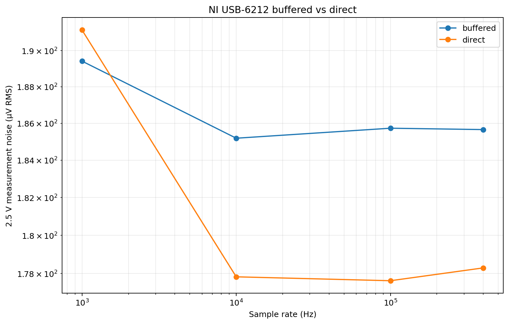

# NI DAQ -- Analog Input

## Overview

The USB-6212 provides 16 analog input channels (AI0-AI15), 16-bit, up to 400 kS/s.
AI0-AI3 are buffered on the motherboard with a unity-gain OPA4388IDR before reaching
the DAQ connector. AI4-AI15 connect directly to the edge connector without buffering.
Channels can be configured as 16 single-ended or 8 differential in software.
Both the buffered and direct input paths were characterized up to 400 kS/s. The direct
inputs showed slightly lower measured noise, while AI0-AI3 provide the OPA4388 buffer
when source isolation or buffering is useful.

## Key Specifications (USB-6212 AI)

| Parameter | Value |
|-----------|-------|
| Channels | 16 single-ended or 8 differential |
| Resolution | 16-bit |
| Max sample rate | 400 kS/s aggregate |
| Input ranges | +/-0.2V, +/-1V, +/-5V, +/-10V |
| CMRR (DC-60Hz) | 100 dB |
| Input impedance (on) | >10 GOhm in parallel with 100 pF |
| Noise (10V range) | 295 uVrms |
| Absolute accuracy (10V range) | 2,710 uV full scale |
| Absolute accuracy (0.2V range) | 89 uV full scale |
| Small signal bandwidth | 1.5 MHz |
| Overvoltage protection | ±30 V on up to two AI pins while powered |

## Signal Conditioning -- OPA4388 Input Buffer

AI0-AI3 pass through a unity-gain OPA4388IDR buffer on the motherboard. The OPA4388
is a zero-drift precision op-amp specifically suited for ADC buffering -- its zero-drift
architecture eliminates 1/f noise, meaning noise performance stays flat down to DC,
which is important for low-frequency and DC characterization measurements.

| Parameter | OPA4388 Value |
|-----------|--------------|
| Offset voltage | ±2.25 µV typical, ±8 µV maximum |
| Offset drift | +/-0.005 uV/degC |
| Noise density | 7 nV/sqrtHz @ 1kHz (no 1/f noise) |
| Low freq noise | 0.14 uVpp (0.1-10Hz) |
| CMRR | 140 dB |
| GBW | 10 MHz |
| Settling time | 2 us to 0.01% |

:::caution Buffered-Channel Input Range

Although the USB-6212 supports bipolar input ranges up to ±10 V, AI0–AI3
pass through an OPA4388 powered from the 5 V analog rail. These buffered
channels are intended for approximately 0–5 V signals. AI4–AI15 connect
directly to the DAQ and retain the native USB-6212 input ranges.
:::

## Python API (`ai.py`)

```python
from hardware import read_single, read_buffered, read_continuous

# Single scan -- one sample per channel
v = read_single(0)                      # ai0 -> float volts
v0, v1, v2 = read_single([0, 1, 2])    # list of channels -> list of floats
all_ch = read_single()                  # all channels from config -> list

# Finite buffered acquisition
volts, times = read_buffered(
    channel=0,
    rate=400_000,        # Hz, max 400 kS/s single channel
    num_samples=4000,
)
# volts: numpy array shape (num_samples,)
# times: numpy array of timestamps in seconds from 0

# Continuous live plot with optional CSV
volts, times = read_continuous(
    channel=0,
    rate=400_000,
    duration=10.0,       # seconds, or None to run indefinitely
    window_sec=0.5,      # rolling window width on live plot
    csv_filename='capture.csv'
)
```

### Configuration (`config.py`)

```python
AI_CHANNELS        = list(range(8))     # ai0-ai7
AI_TERMINAL_CONFIG = "SingleEnded"      # "SingleEnded" | "Differential" | "Pseudodiff"
AI_VOLTAGE_RANGE   = (-10.0, 10.0)     # (min_V, max_V)
AI_DEFAULT_RATE    = 400_000            # Hz
AI_DEFAULT_SAMPLES = 4_000
```

## Measured Performance

Single-channel acquisition is confirmed from **1 kS/s to 400 kS/s** with live streaming
and CSV recording. `read_continuous()` uses hardware-clocked acquisition, allowing
continuous operation at the full 400 kS/s single-channel rate.

The characterization compared a representative **OPA4388-buffered input** with a
**direct USB-6212 input** using shorted-input and approximately 2.5 V reference
measurements.



| Rate | Buffered signal noise | Direct signal noise | Buffered 1–200 Hz noise | Direct 1–200 Hz noise |
|-----:|----------------------:|--------------------:|-----------------------:|---------------------:|
| 1 kS/s | 189.42 µV RMS | 191.15 µV RMS | 125.86 µV RMS | 124.95 µV RMS |
| 10 kS/s | 185.19 µV RMS | 177.83 µV RMS | 58.62 µV RMS | 55.84 µV RMS |
| 100 kS/s | 185.74 µV RMS | 177.62 µV RMS | 49.16 µV RMS | 46.11 µV RMS |
| 400 kS/s | 185.66 µV RMS | 178.29 µV RMS | 48.26 µV RMS | 45.11 µV RMS |

At **400 kS/s**, the direct input measured approximately **178 µV RMS** signal noise,
while the buffered input measured approximately **186 µV RMS**. The direct path is
therefore slightly quieter in the tested configuration, while both retain the full
high-rate acquisition capability.

Two-point DC accuracy at approximately 2.5 V was also good for both configurations:
approximately **-100 ppm** for the direct input and **-88 ppm** for the representative
buffered input at 400 kS/s.

For general high-rate acquisition where the source can directly drive the USB-6212,
**AI4-AI15** provide the native bipolar input range and slightly lower measured noise.
**AI0-AI3** provide the OPA4388 buffer when buffering or source isolation is useful.
