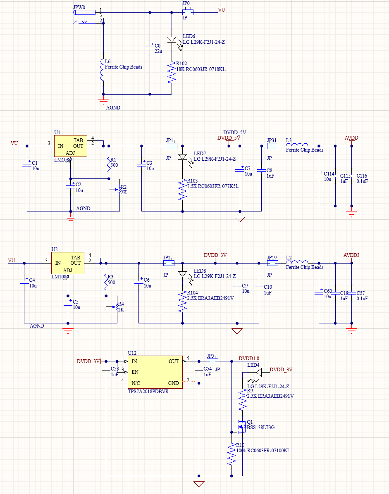

# Power System

## Overview

The station runs from a single **9V DC input** (VU rail, from Rigol DP831 or wall adapter).
Three regulators generate all on-board rails. Each rail has a digital supply (DVDD)
separated from the analog supply (AVDD) by a ferrite bead, preventing digital switching
noise from coupling into precision analog measurements. Each rail has an LED indicator
and an enable jumper (JP1, JP2, JP5) for independent control.

## Schematic



## Rail Architecture

```
9V Input (VU)
  |-- LM1086 (U1, adj) --> DVDD_5V --[JP3, ferrite L3]--> AVDD_5V
  |-- LM1086 (U2, adj) --> DVDD_3V --[JP19, ferrite L2]--> AVDD_3V
  |-- TPS7A2018 (U12)  --> DVDD_1V8  (powered from DVDD_3V)
  `-- ADR4525CRZ       --> 2.5V REF  (analog reference only)
```

## Key Specifications

| Parameter | LM1086 5V (U1) | LM1086 3.3V (U2) | TPS7A2018 1.8V (U12) | ADR4525CRZ 2.5V REF |
|-----------|---------------|-----------------|---------------------|---------------------|
| Input | 9V (VU) | 9V (VU) | DVDD_3V | 9V (VU) |
| Output | DVDD_5V | DVDD_3V | DVDD_1V8 (fixed) | 2.500V (fixed) |
| Output current | 1.5A max | 1.5A max | 200mA max | -- |
| Dropout voltage | 1.5V at 1.5A | 1.5V at 1.5A | -- | -- |
| Ripple rejection | 75 dB typ | 75 dB typ | Ultra-low noise | Ultra-low noise |
| Set by | R1=500 Ohm, R2=2K pot | R3=500 Ohm, R4=2K pot | Fixed | Fixed |
| Initial accuracy | Trimmed to 5.00V | Trimmed to 3.30V | -- | +/-0.02% (+/-5mV) |
| Temp coefficient | -- | -- | -- | 2 ppm/degC typ |
| Output formula | Vout = 1.25 x (1 + R2/R1) | Vout = 1.25 x (1 + R4/R3) | -- | -- |

Trim R2 and R4 to hit exactly 5.00V and 3.30V on first use.
See [Hardware Setup](../../getting-started/hardware-setup#ldo-voltage-adjustment) for the trimming procedure.
The 2.5V reference feeds the DAC80508 REF pin (when the external reference jumper is populated) and the TIA reference voltage.

## Rail Summary

| Rail | Net name | Regulator | Powers |
|------|----------|-----------|--------|
| 5V digital | DVDD_5V | LM1086 U1 | DAC logic, NI DAQ edge connector |
| 5V analog | AVDD_5V | DVDD_5V + ferrite L3 | DAC analog outputs |
| 3.3V digital | DVDD_3V | LM1086 U2 | STM32, ADC digital, level translators |
| 3.3V analog | AVDD_3V | DVDD_3V + ferrite L2 | ADC analog front end |
| 1.8V | DVDD_1V8 | TPS7A2018 U12 | Low-voltage logic |
| 2.5V REF | -- | ADR4525CRZ | DAC reference, TIA reference |

## Measured Performance

*Rail noise and ripple measurements -- to be added*