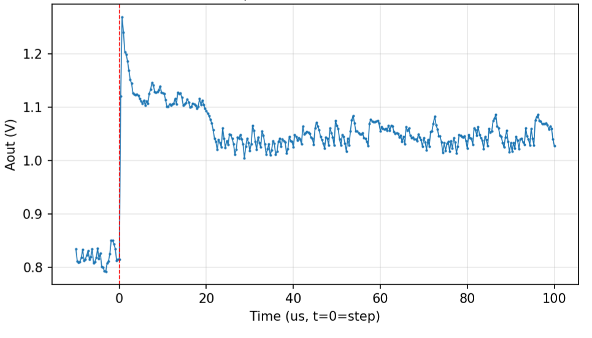

# STM32 -- Internal ADC

## Overview

The STM32H743 has four internal ADC channels on PA1-PA4, 16-bit, 0-3.3V range.
These serve two distinct roles: slow single-sample reads for monitoring on-board signals
via USB CDC, and high-speed burst capture for step response and transient measurements.

For step response capture, ADC1 on PA1 is triggered by TIM1/TRGO2 with DMA2_Stream0,
allowing burst captures from 10 kSPS up to 3.2 MSPS into a 8000-sample SRAM buffer.
The binary transfer protocol reduces transfer time substantially compared with
ASCII formatting. A 1,000-sample capture completes in approximately 100 ms
round trip.

## Pin Mapping

| Label | STM32 Pin | ADC | Channel |
|-------|-----------|-----|---------|
| MCU_ADC1 | PA1 | ADC1 | INP17 -- fast burst capture supported |
| MCU_ADC2 | PA2 | ADC1 | INP14 |
| MCU_ADC3 | PA3 | ADC1 | INP15 |
| MCU_ADC4 | PA4 | ADC2 | INP18 |

## Key Specifications

| Parameter | Value |
|-----------|-------|
| Resolution | 16-bit |
| Input range | 0-3.3V |
| Slow read rate (via CDC) | ~1 kSPS (USB-limited) |
| Fast burst rate (PA1 only) | 10 kSPS to 3.2 MSPS (TIM1/DMA) |
| Max burst samples | 8000 per capture |
| Fast transfer | Approximately 100 ms round trip for 1,000 samples |
| Trigger source | TIM1/TRGO2 (hardware, no CPU involvement) |
| DMA | DMA2_Stream0 -> non-cacheable SRAM buffer |

## Fast Burst Capture (PA1)

For transient measurements -- step response, slew rate capture, switching events --
the ADC1/PA1 path uses TIM1/TRGO2 to trigger conversions at precise hardware-clocked
intervals, with DMA2_Stream0 moving samples directly into a non-cacheable SRAM buffer.
No CPU involvement during the capture itself.

TIM1 fires at the configured rate, triggering ADC1 on each tick. DMA2_Stream0 moves
each 16-bit result directly into `g_adcfast_buf[]` in non-cacheable SRAM3 with no CPU
involvement. When all samples are captured, the DMA completion callback stops TIM1 and
ADC, restores normal polling mode, then sends the entire buffer as a single binary CDC
payload to the PC.

### SRAM3 Buffer Allocation

In the current firmware, DMA buffers are placed in SRAM3 (D2 domain, 32 KB total at `0x30040000`), which is configured as non-cacheable to avoid cache-coherency problems.

| Buffer | Size | Notes |
|--------|------|-------|
| ADC fast capture (`g_adcfast_buf`) | 16 KB (8000 x uint16) | Current max capture |
| ADS131A04 ring buffers (x2 chips) | 7.5 KB (256 slots x 15 bytes x 2) | ADS131 DMA streaming |
| ADS131A04 DMA receive bufs (x2) | 30 bytes | One 15-byte frame per chip |
| USB CDC TX/RX buffers | 2 KB | |
| **Total used** | **~25.2 KB** | |
| **Headroom remaining** | **~6.8 KB** | |

For much larger captures, the buffer can be relocated to **AXI SRAM** (512 KB, D1 domain at
`0x24000000`), which is also accessible by DMA2. This would allow up to **262,144 samples**
(~512 KB at uint16), giving 262 ms at 1 MSPS or 82 ms at 3.2 MSPS -- sufficient to capture
multi-cycle transients and long settling tails.

## Firmware

Driver files: `stm_adc.c`, `stm_adc.h`

```c
// Start a burst capture on PA1
// Returns 1 immediately; poll ADC_Capture_Done() for completion
uint8_t ADC_Capture_Start(uint32_t n_samples, uint32_t prescaler, uint32_t period);

// Check if capture is complete
uint8_t ADC_Capture_Done(void);

// Get pointer to raw sample buffer (uint16_t[8000], non-cacheable SRAM)
uint16_t* ADC_Capture_GetBuffer(void);
```

## Python API

### Slow reads -- all 4 channels (`stm_adc.py`)

```python
from hardware.stm_adc import STMADC

adc = STMADC()

# Single read
v = adc.read_single(1)           # PA1 -> float volts
v = adc.read_single("ALL")       # all 4 -> {'PA1': V, 'PA2': V, 'PA3': V, 'PA4': V}

# Buffered (CDC-limited, ~1 kSPS)
volts, times = adc.read_buffered(channel=1, n=500)
# volts: numpy array, times: timestamps in seconds

# Continuous live plot
adc.read_continuous(channel=1, duration=10.0, window_sec=2.0)
```

### Fast burst capture -- PA1 only (`stm_adc_fast.py`)

```python
from hardware.stm_adc_fast import capture_at_rate, capture

# Capture 1000 samples at 100 kSPS on PA1
result = capture_at_rate(n_samples=1000, rate_hz=100_000)
# result['voltage']       -- numpy array of float volts
# result['raw']           -- numpy array of uint16 raw codes
# result['n']             -- number of samples
# result['rate_hz']       -- assumed sample rate (from clock math)
# result['round_trip_s']  -- total wall-clock time for the exchange

# Or specify prescaler/period directly for fine control
result = capture(n_samples=8000, prescaler=0, period=74)

# Example: capture a step response at 1 MSPS
result = capture_at_rate(n_samples=8000, rate_hz=1_000_000)
import matplotlib.pyplot as plt
plt.plot(result['voltage'])
plt.show()
```

## Measured Performance

Fast burst capture confirmed working from **10 kSPS to 3.2 MSPS** (PA1) with zero
overrun errors. Binary transfer of 1000 samples takes approximately 100ms round trip,
versus ~10s for the equivalent ASCII transfer -- over 100x improvement.

The plot below shows a step response capture on PA1 at 3.2 MSPS (1 sample per ~312 ns).
STM GPIO output steps at t=0 (red dashed line). The initial overshoot and multi-stage
settling are clearly resolved -- the output reaches its first plateau around 10 us and
final steady state around 50 us. 

