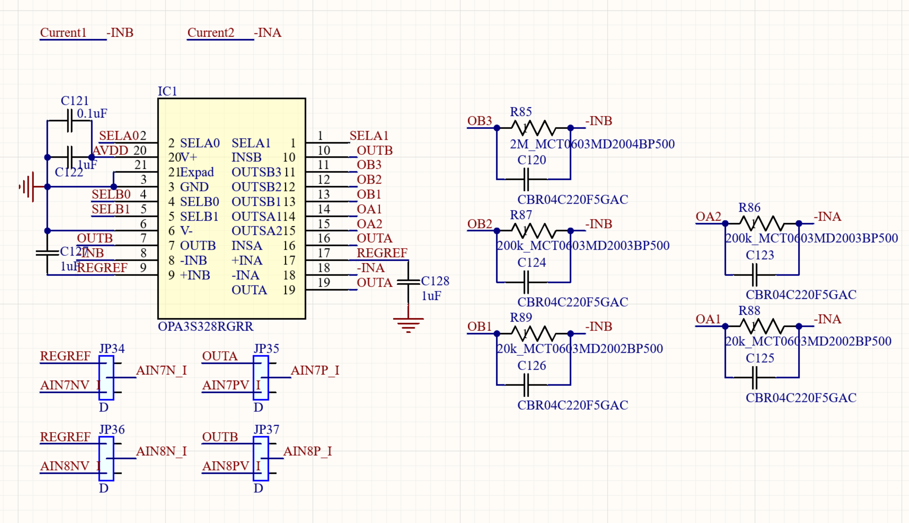

# TIA -- Current Measurement

## Overview

A single OPA3S328RGRR dual op amp is configured as two independent
transimpedance amplifiers, Amp A and Amp B. The chip's integrated analog
switches select the feedback resistance through STM32 GPIO, providing two
current ranges on Amp A and three on Amp B without manual hardware changes. Calibration against
the Keithley 2450 SMU extracts the effective feedback resistance and voltage
offset for each range, including the resistance of the integrated
switches.

## Schematic



## Key Specifications (OPA3S328)

| Parameter | Value |
|-----------|-------|
| Topology | Precision CMOS op-amp with integrated analog switches |
| GBW | 40 MHz |
| Input bias current | ±0.2 pA typical |
| Input offset voltage | 10 µV typical, ±60 µV maximum |
| Output swing | Rail-to-rail |
| Switch RON | 84 Ω typical, 125 Ω maximum at 5 V |
| Package | VQFN-20 (RGRR) |

## Hardware Configuration

### Feedback Resistors and Ranges

All ranges have 22 pF feedback capacitors for stability. Calibrated Rf values include switch RON extracted from the Keithley calibration sweep.

**Amp A:**

| Range | Rf nominal | Rf calibrated | Full scale | ADC rate | GPIO |
|-------|-----------|--------------|-----------|---------|------|
| A_2K | 2 kOhm | -- | +/-1.2 mA | 5 kSPS (OSR_400) | SELA1=0 SELA0=0 |
| A_20K | 20 kOhm | -- | +/-100 uA | 5 kSPS (OSR_400) | SELA1=0 SELA0=1 |

**Amp B:**

| Range | Rf nominal | Rf calibrated | Full scale | ADC rate | Noise floor | GPIO |
|-------|-----------|--------------|-----------|---------|------------|------|
| B_20K | 20 kOhm | 20,019 Ohm | +/-100 uA | 5 kSPS (OSR_400) | ~16.7 nA | SELB1=0 SELB0=0 |
| B_200K | 200 kOhm | 196,691 Ohm | +/-10 uA | 0.5 kSPS (OSR_4096) | ~10.4 nA | SELB1=0 SELB0=1 |
| B_2M | 2 MOhm | 1,868,680 Ohm | +/-1 uA | 0.5 kSPS (OSR_4096) | ~5.0 nA | SELB1=1 SELB0=0 |

### GPIO Pin Assignment

| Signal | STM32 Pin | Controls |
|--------|-----------|---------|
| SELA0 | PE8 | Amp A switch select bit 0 |
| SELA1 | PE9 | Amp A switch select bit 1 |
| SELB0 | PE7 | Amp B switch select bit 0 |
| SELB1 | PE6 | Amp B switch select bit 1 |

### Output Routing

Amp A output (OUTA) is read differentially on ADS131A04 Chip 2 Channel 3, and Amp B output (OUTB) on Chip 2 Channel 4, both referenced against the 2.5V REGREF. The TIA is inverting -- a positive input current produces a negative output voltage, corrected in the Python conversion.

## Calibration

Calibration uses the Keithley 2450 as a reference current source. Connect Keithley HI
to `−INB` on the board and Keithley LO to board `GND`. The calibration sweeps
21 current points from `−Imax` to `+Imax` for each selected range, fits a
linear model, and extracts the effective feedback resistance and voltage
offset:

```
I = -(V_ch4 - V_offset) / Rf_eff
```

Results are saved to `tia_cal.json` and loaded automatically on `TIA()` init. Run calibration once when the hardware is first set up, or after any hardware change.

## Firmware

Driver files: `tia.c`, `tia.h`

```c
void        TIA_Init(void);                  // init GPIO, boot defaults: A=2kOhm, B=20kOhm
int         TIA_SetGainA(TIA_GainA_t gain);  // TIA_A_2K | TIA_A_20K, returns 0 on success
int         TIA_SetGainB(TIA_GainB_t gain);  // TIA_B_20K | TIA_B_200K | TIA_B_2M | TIA_B_OFF
TIA_State_t TIA_GetState(void);              // read back active gain state for both amps
uint32_t    TIA_GetRfA(void);                // nominal Rf in Ohm for Amp A (excludes RON)
uint32_t    TIA_GetRfB(void);                // nominal Rf in Ohm for Amp B (excludes RON)
```

## Python API (`tia.py`)

```python
from hardware.tia import TIA

# -- First time: calibrate with Keithley connected --
tia = TIA(skip_cal=True)
tia.calibrate()                    # sweeps all 3 ranges, saves tia_cal.json
tia.calibrate(ranges=['B_20K'])    # calibrate one range only

# -- Every session: calibration loads automatically --
tia = TIA()                        # loads tia_cal.json on init
tia.set_range('B_20K')             # 'B_20K' | 'B_200K' | 'B_2M'

# -- Readings --
i = tia.read()                     # single reading -> uA
i = tia.read_avg(n=64)             # average of n frames -> uA
f = tia.read_frame()               # dict: current_uA, voltage_V, range, rf_eff, timestamp
v = tia.read_voltage()             # raw ADS131 voltage before conversion -> V

# -- Statistics and recording --
tia.print_current(n=32)            # print averaged reading to console
s = tia.stats(n=256)               # dict: mean_uA, std_nA, min_uA, max_uA
tia.print_stats(n=256)             # print stats to console
t, i = tia.record(duration=10.0)   # record for N seconds -> (times, currents) numpy arrays

# -- Live scrolling plot, blocks until window closed --
tia.live(window=200, n_avg=8)
```

## Measured Performance

The ADC rate is set per range: B_20K uses 5 kSPS (OSR_400) for wider measurement bandwidth,
while B_200K and B_2M drop to 0.5 kSPS (OSR_4096) to maximise decimation filter averaging
and reduce the noise floor for small current measurements.

An approximately 12 nA zero-input offset has been observed. Its source
has not yet been isolated; possible contributors include board leakage,
common-mode-to-differential conversion, and measurement-chain offset.
Treat readings below approximately 15 nA cautiously.